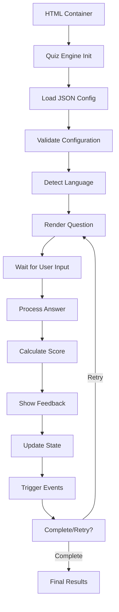

# Quiz Engine Architecture

Quiz Engine is designed as a lightweight, modular JavaScript library that can be easily integrated into any web project. This document outlines the architectural principles and design decisions that guide the project.

## Design Principles

### 1. Simplicity First
- **Minimal dependencies**: Zero external dependencies in core functionality
- **Easy integration**: Single script include or simple npm install
- **Clear API**: Intuitive configuration through JSON

### 2. Performance
- **Lazy loading**: Components load only when needed
- **Small footprint**: Minified version under 50KB
- **Efficient rendering**: Minimal DOM manipulation

### 3. Extensibility
- **Plugin architecture**: Support for custom question types and themes
- **Event system**: Hooks for custom functionality
- **Configuration-driven**: Behavior controlled through declarative config

### 4. Accessibility
- **WCAG compliance**: Follows Web Content Accessibility Guidelines
- **Keyboard navigation**: Full keyboard support
- **Screen reader friendly**: Proper ARIA labels and semantic HTML

## Core Components

```
┌─────────────────────────────────────────────────────────┐
│                    Quiz Engine Core                     │
├─────────────────────────────────────────────────────────┤
│  ┌─────────────┐  ┌─────────────┐  ┌─────────────┐     │
│  │   Config    │  │   i18n      │  │   Events    │     │
│  │   Manager   │  │   System    │  │   System    │     │
│  └─────────────┘  └─────────────┘  └─────────────┘     │
├─────────────────────────────────────────────────────────┤
│  ┌─────────────┐  ┌─────────────┐  ┌─────────────┐     │
│  │  Question   │  │   Answer    │  │  Feedback   │     │
│  │  Renderer   │  │  Processor  │  │  Manager    │     │
│  └─────────────┘  └─────────────┘  └─────────────┘     │
├─────────────────────────────────────────────────────────┤
│  ┌─────────────┐  ┌─────────────┐  ┌─────────────┐     │
│  │   Theme     │  │  Validation │  │   Storage   │     │
│  │   Engine    │  │   System    │  │   Manager   │     │
│  └─────────────┘  └─────────────┘  └─────────────┘     │
└─────────────────────────────────────────────────────────┘
```

## Module Breakdown

### Core Engine (`quiz-engine.js`)
The main entry point that:
- Discovers quiz containers in the DOM
- Loads quiz configurations from JSON files
- Manages the quiz lifecycle
- Coordinates all other modules

### Configuration Manager
Handles:
- JSON schema validation
- Default value application
- Configuration inheritance and merging
- Type-specific configuration processing

### Internationalization System
Features:
- Language detection from browser/URL
- Dynamic content loading based on language
- RTL language support
- Fallback language handling

### Question Renderer
Responsible for:
- Generating question HTML based on type
- Applying themes and styling
- Managing question state
- Handling user interactions

### Answer Processor
Handles:
- Answer validation logic
- Scoring calculations
- Result determination
- Feedback generation

### Event System
Provides:
- Lifecycle event hooks
- Custom event registration
- Plugin integration points
- State change notifications

## Data Flow



## Question Type Architecture

Each question type implements a common interface:

```javascript
class QuestionType {
  constructor(config, data) {
    this.config = config;
    this.data = data;
  }

  render(container) {
    // Generate HTML for the question type
  }

  validate(userAnswer) {
    // Validate user input
  }

  calculateScore(userAnswer) {
    // Calculate score based on correctness
  }

  generateFeedback(userAnswer) {
    // Generate appropriate feedback
  }
}
```

### Supported Question Types

1. **SingleChoice**: Radio button selection
2. **MultipleChoice**: Checkbox selection
3. **TextInput**: Free text input with matching
4. **TrueFalse**: Binary choice questions

### Adding New Question Types

To add a new question type:

1. Create a new class extending `QuestionType`
2. Implement required methods
3. Register the type with the engine
4. Add configuration schema

## State Management

Quiz Engine uses a simple state machine:

```
┌─────────────┐    load     ┌─────────────┐
│    INIT     │ ─────────► │   LOADING   │
└─────────────┘            └─────────────┘
                                   │
                            render │
                                   ▼
┌─────────────┐            ┌─────────────┐
│  COMPLETE   │ ◄───────── │    READY    │
└─────────────┘   submit   └─────────────┘
      │                            │
      │                     answer │
      │                            ▼
      │                    ┌─────────────┐
      └──────────────────► │ ANSWERING   │
           retry           └─────────────┘
```

States:
- **INIT**: Initial state, quiz not yet loaded
- **LOADING**: Configuration and assets loading
- **READY**: Quiz rendered, awaiting user input
- **ANSWERING**: User has provided input, processing
- **COMPLETE**: Quiz finished, showing results

## File Structure

```
quiz/
├── src/
│   ├── core/
│   │   ├── quiz-engine.js      # Main engine
│   │   ├── config-manager.js   # Configuration handling
│   │   └── event-system.js     # Event management
│   ├── types/
│   │   ├── single-choice.js    # Single choice questions
│   │   ├── multiple-choice.js  # Multiple choice questions
│   │   ├── text-input.js       # Text input questions
│   │   └── true-false.js       # True/false questions
│   ├── i18n/
│   │   ├── language-detector.js
│   │   └── translations/
│   │       ├── en.json
│   │       └── ru.json
│   ├── themes/
│   │   ├── default.css
│   │   ├── minimal.css
│   │   └── dark.css
│   └── utils/
│       ├── dom-utils.js
│       ├── validation.js
│       └── storage.js
├── dist/
│   ├── quiz-engine.js          # Development build
│   ├── quiz-engine.min.js      # Production build
│   └── quiz-engine.css         # Compiled styles
└── __tests__/
    ├── core/
    ├── types/
    └── integration/
```

## Performance Considerations

### Bundle Size
- Core engine: ~30KB minified
- Each question type: ~3-5KB
- Themes: ~2-5KB each
- Total typical bundle: ~45KB

### Memory Usage
- Minimal memory footprint
- Cleanup on quiz completion
- No memory leaks in typical usage

### Loading Strategy
- Async configuration loading
- Progressive enhancement
- Graceful degradation without JavaScript

## Browser Support

Quiz Engine supports:
- **Modern browsers**: Chrome 60+, Firefox 55+, Safari 11+, Edge 79+
- **Mobile browsers**: iOS Safari 11+, Chrome Mobile 60+
- **Legacy support**: IE11 with polyfills (optional)

## Security Considerations

- **XSS Prevention**: All user input is sanitized
- **CSRF Protection**: No state-changing GET requests
- **Content Security Policy**: Compatible with strict CSP
- **Input Validation**: Server-side validation recommended for critical applications

## Testing Strategy

- **Unit Tests**: Jest for core functionality
- **Integration Tests**: Real browser testing
- **E2E Tests**: Cypress for user workflows
- **Visual Regression**: Percy for UI consistency
- **Performance Tests**: Lighthouse CI integration

## Extension Points

Quiz Engine provides several extension points:

### Custom Question Types
Register new question types through the plugin system.

### Custom Themes
Add CSS files and register theme metadata.

### Event Hooks
Listen to quiz lifecycle events for analytics or custom behavior.

### Validation Rules
Add custom validation for text input questions.

### Storage Adapters
Implement custom storage for quiz results and progress.